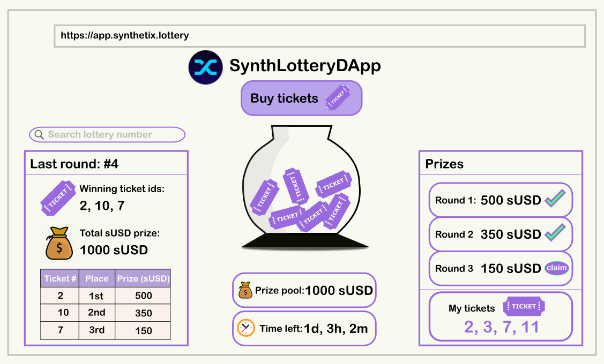

# synthetix-lottery

Solution for Open DeFi Hackathon bounty: https://gitcoin.co/issue/snxgrants/open-defi-hackathon/8/100025689

### Design:



### Guide:

There is a single file SLottery.sol contract. It inherits from Openzeppelin's ERC721.sol smart contract, the Ownable.sol smart contract and Chainlink's VRFConsumerbase.sol smart contract. Let's see its functionality:

1. Buy ticket(s):\
   a) The function takes two parameters - the recipient, aka the wallet address that will get the ticket(s) (in the form of a non-fungible token), and the amount of tickets to purchase.
   The function caller will basically pay for the tickets that will go into recipient wallet.\
   b) Note: the function caller must approve the SLottery.sol smart contract to transfer sUSD on his behalf to the smart contract, since we are
   using the ERC20 transferFrom() function;\
   c) The amount paid in sUSD is added to the current lottery pool. Each lottery has a duration of 6 hours for this demo. For the live version one lottery will run for a week;\
   d) The NFT tickets are minted and two values are returned: ticket id start and ticket id end, as the range of ticket ids that were purchased.

2. Announce Winners:\
   a) The function takes one parameter - the userProvidedSeed which Chainlink's VRFCoordinator.sol contract needs to kick off the randomization process;\
   b) Any user can call this function and announce winners. It is required that the current lottery has a minimum of three tickets, has expired and that the SLottery.sol contract has enough LINK tokens (0.1 LINK is needed) to cover the fee provided to Chainlink's oracle contract which does the randomization
   for us;\
   c) A request is sent to the Chainlink oracle. For it we need a keyHash which is used to identify the needed oracle, the above mentioned fee and the userProvidedSeed
   which could be any random uint256 number;\
   d) After this request is submitted and processed, the callback function fulfillRandomness(bytes32 requestId, uint256 randomness) is called and
   the requestId is the one which we have received from the requestRandomness(keyHash, fee, userProvidedSeed) function, whereas the randomness is
   our random number;\
   e) Since we have 3 winners we need to actually generate 3 random numbers. We use the random number from the VRF response to make for the 3 values we needed and we save LINK tokens with a single call instead of three;\
   f) After the three winners have been announced taking into account all existing NFTs, the next lottery starts and the game continues.

3. Claim prizes:\
   a) We have three separate functions for each of the prizes;\
   b) Each of them checks whether a given ticket/NFT id has won the corresponding prize for a given lottery id and whether the owner of that NFT is the one calling the function;\
   c) The first place receives 50% of the sUSD in the lottery prize pool;\
   d) The second place receives 35% of the sUSD in the lottery prize pool;\
   e) The third place receives 15% of the sUSD in the lottery prize pool;\
   f) We identify what prizes are still pending to be claimed so that the winner can only claim his prize once;

## Development

### Blockchain + Smart Contracts

#### Setup for local blockchain environment

Install [Truffle](https://www.trufflesuite.com/docs/truffle/getting-started/installation).
Then you can run the following commands to deploy the smart contracts and also test them.

```PS
npm install     # install dependencies such as @chainlink/contracts and @openzeppelin/contracts
truffle migrate --network [networkName] # build and deploy the smart contracts on a given network
truffle test    # run the tests
```

Node (npm) helps us to run scripts, we have everything in a single command by running:

```PS
npm run test     # will compile contracts, deploy them to development network and test
npm run test:reset    # will force compile all contracts, reset development network migrating all contracts again and run the tests
```

#### Learn More

Check out the [Truffle documentation](https://www.trufflesuite.com/docs/truffle/overview).
